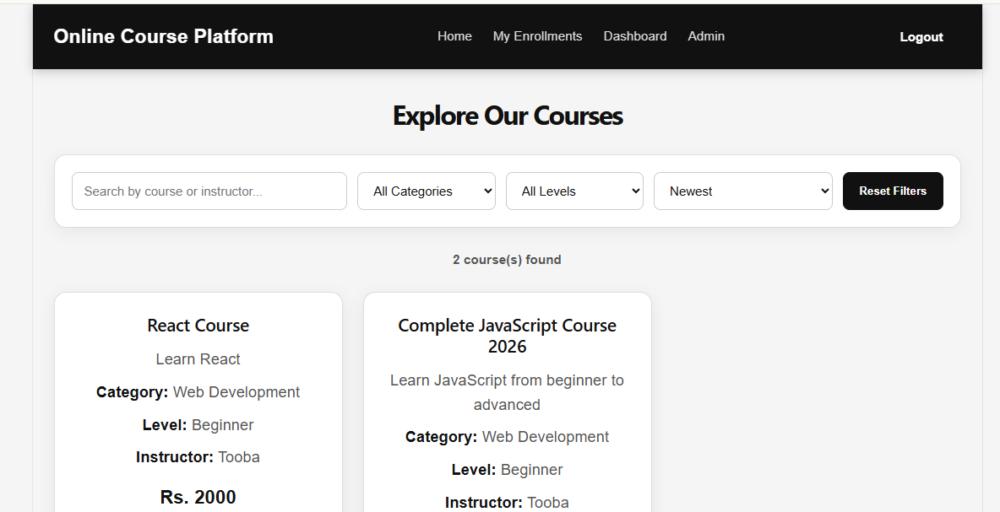
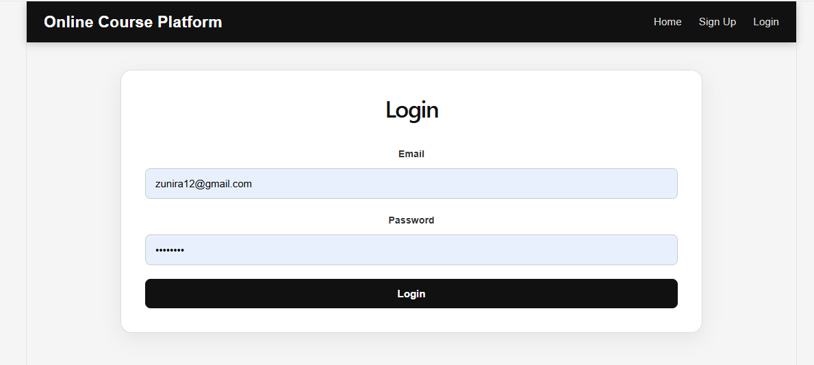
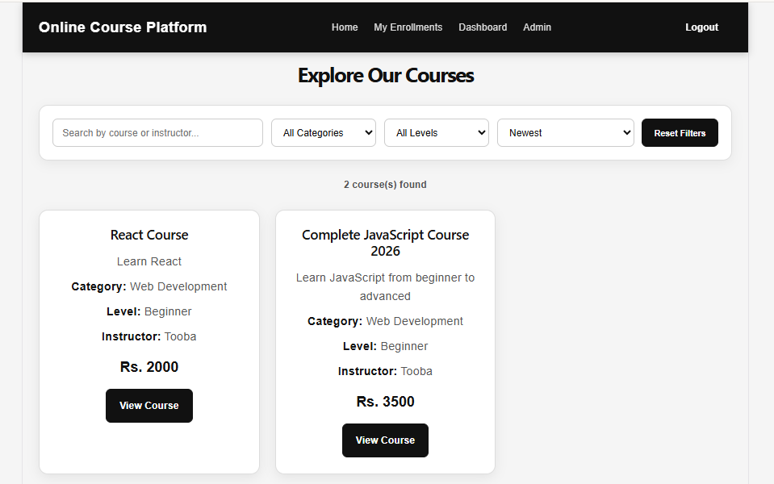
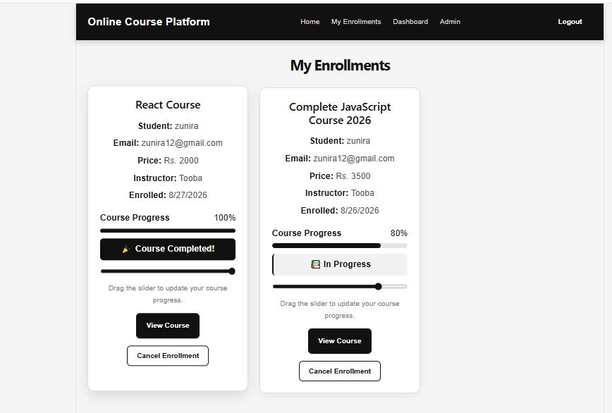
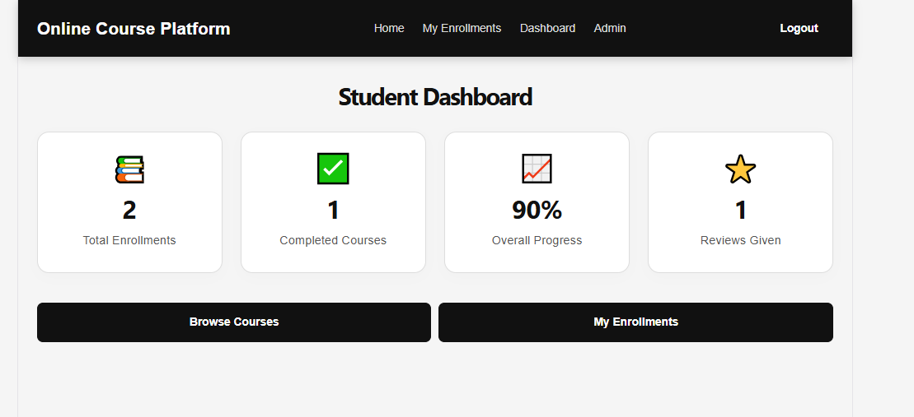
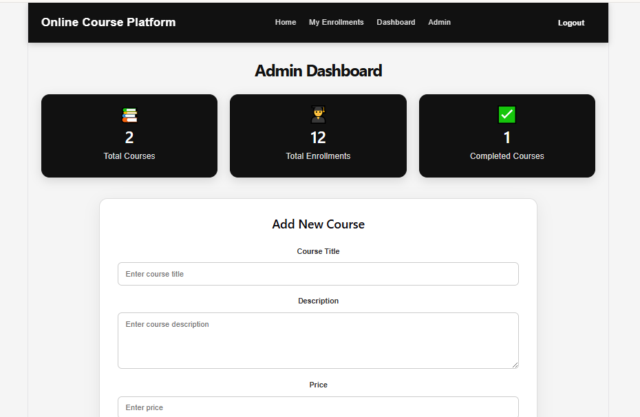

# 📚 Online Course Platform

A full-stack **Online Course Platform** built with **React, Node.js, Express.js, and MongoDB**.
Students can browse courses, enroll in courses, complete lessons, track their progress, and submit reviews. Admins can manage courses, lessons, and student enrollments.

## ✨ Features

### 👨‍🎓 Student Features

* User Signup & Login
* Browse available courses
* View detailed course information
* View course lessons
* Enroll in courses
* Mark lessons as completed
* Track course progress
* View completed courses
* Submit course reviews and ratings
* View student reviews
* Student Dashboard
* My Enrollments page

### 👩‍💻 Admin Features

* Admin Dashboard
* Add new courses
* Edit courses
* Delete courses
* Add course lessons
* Remove lessons
* View all courses
* View all student enrollments
* Monitor student progress
* Update enrollment progress
* View completed courses

## 🛠️ Technologies Used

### Frontend

* React.js
* React Router
* Axios
* JavaScript
* HTML5
* CSS3
* Vite

### Backend

* Node.js
* Express.js
* MongoDB
* Mongoose
* REST API

## 📂 Project Structure

```text
online-course-platform/
│
├── backend/
│   ├── models/
│   │   ├── Enrollment.js
│   │   ├── Review.js
│   │   ├── User.js
│   │   └── course.js
│   │
│   ├── routes/
│   │   ├── authRoutes.js
│   │   ├── courseRoutes.js
│   │   ├── enrollmentRoutes.js
│   │   └── reviewRoutes.js
│   │
│   ├── app.js
│   ├── db.js
│   ├── package.json
│   └── package-lock.json
│
├── src/
│   ├── AdminDashboard.jsx
│   ├── CourseDetails.jsx
│   ├── Dashboard.jsx
│   ├── Home.jsx
│   ├── Login.jsx
│   ├── MyEnrollments.jsx
│   ├── Navbar.jsx
│   ├── Signup.jsx
│   ├── App.jsx
│   ├── App.css
│   └── main.jsx
│
├── public/
├── package.json
├── vite.config.js
└── README.md
```

## ⚙️ Installation

### 1. Clone the Repository

```bash
git clone https://github.com/ToobaJabeen/online-course-platform.git
```

### 2. Open the Project

```bash
cd online-course-platform
```

### 3. Install Frontend Dependencies

```bash
npm install
```

### 4. Install Backend Dependencies

```bash
cd backend
npm install
```

## 🗄️ MongoDB Setup

Make sure MongoDB is running on your computer.

The backend connects to MongoDB through the database configuration in:

```text
backend/db.js
```

## ▶️ Run the Application

### Start Backend

Open a terminal inside the `backend` folder:

```bash
node app.js
```

The backend will run on:

```text
http://localhost:3000
```

### Start Frontend

Open another terminal in the main project folder:

```bash
npm run dev
```

The frontend will run on:

```text
http://localhost:5173
```

## 🔗 Main Pages

* Home
* Login
* Signup
* Course Details
* Student Dashboard
* My Enrollments
* Admin Dashboard

## 📊 Course Progress

Students can mark individual lessons as completed.

The platform automatically calculates course progress based on completed lessons.

Example:

```text
1 / 1 lessons completed = 100%
```

When progress reaches 100%, the course is displayed as:

```text
🎉 Course Completed!
```

## ⭐ Reviews & Ratings

Students can:

* Give a rating from 1 to 5 stars
* Write a course review
* View existing student reviews
* See the average course rating

## 🔐 Authentication

The platform includes:

* Student Signup
* Student Login
* User information stored for logged-in sessions
* Protected enrollment/review functionality

## 🚀 Future Improvements

Possible future improvements include:

* JWT authentication
* Admin authentication
* Payment integration
* Video hosting
* Search and filtering
* Course categories
* Certificate generation
* Forgot password functionality
* Deployment to production

## 👩‍💻 Author

**Tooba Jabeen**

GitHub:
https://github.com/ToobaJabeen

## 📌 Project

**Online Course Platform**

A full-stack learning management platform developed as a portfolio project using the MERN stack.


## 📸 Screenshots

### 🏠 Home Page


### 🔐 Login Page


### 📚 Course Details


### 🎓 My Enrollments


### 📊 Student Dashboard


### 👩‍💻 Admin Dashboard

